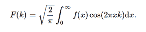

# python 中的积分、变换、余弦变换()

> 原文:[https://www . geesforgeks . org/sympy-积分-变换-python 中的余弦变换/](https://www.geeksforgeeks.org/sympy-integrals-transforms-cosine_transform-in-python/)

借助**余弦变换()**方法，我们可以计算余弦变换，并使用该方法返回变换后的函数。



余弦变换

> **语法:**余弦变换(f，x，k，* *提示)
> 
> **返回:**返回转换后的函数。

**示例#1 :**

在这个例子中我们可以看到，通过使用**余弦变换()**方法，我们能够计算余弦变换并返回变换后的函数。

## 蟒蛇 3

```
# import cosine_transform
from sympy import cosine_transform, exp, sqrt, cos
from sympy.abc import x, k, a

# Using cosine_transform() method
gfg = cosine_transform(exp(-a * x), x, k)

print(gfg)
```

**输出:**

> sqrt(2)*a/(sqrt(pi)*(a**2 + k**2))

**例 2 :**

## 蟒蛇 3

```
# import cosine_transform
from sympy import cosine_transform, exp, sqrt, cos
from sympy.abc import x, k, a

# Using cosine_transform() method
gfg = cosine_transform(exp(-a * x), x, 5)

print(gfg)
```

**输出:**

> sqrt(2)*a/(sqrt(pi)*(a**2 + 25))