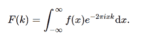

# python 中的症状积分变换傅里叶变换

> 原文:[https://www . geeksforgeeks . org/sympy-integrations-transforms-Fourier _ transform-in-python/](https://www.geeksforgeeks.org/sympy-integrals-transforms-fourier_transform-in-python/)

借助**傅里叶变换()**方法，我们可以计算傅里叶变换，它将返回变换后的函数。



傅立叶变换函数

> **语法:**傅里叶变换(f，x，k，* *提示)
> 
> **返回:**返回转换后的函数。

**示例#1 :**

在这个例子中，我们可以看到，通过使用**傅立叶变换()**方法，我们能够计算傅立叶变换并返回转换后的函数。

## 蟒蛇 3

```py
# import fourier_transform
from sympy import fourier_transform, exp
from sympy.abc import x, k

# Using fourier_transform() method
gfg = fourier_transform(exp(-x**2), x, k)

print(gfg)
```

**输出:**

> sqrt(pi)*exp(-pi**2*k**2)

**例 2 :**

## 蟒蛇 3

```py
# import fourier_transform
from sympy import fourier_transform, exp
from sympy.abc import x, k

# Using fourier_transform() method
gfg = fourier_transform(exp(-x**2), x, 4)

print(gfg)
```

**输出:**

> sqrt(pi)*exp(-16*pi**2)