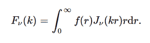

# python 中的 sympy . integrations . transforms . Hankel _ transform()

> 原文:[https://www . geeksforgeeks . org/sympy-integrations-transforms-Hankel _ transform-in-python/](https://www.geeksforgeeks.org/sympy-integrals-transforms-hankel_transform-in-python/)

借助 **hankel_transform()** 方法，我们可以计算 hankel 变换，并使用该方法返回变换后的函数。



汉克尔变换

> **语法:** hankel_transform(f，r，k，nu，* *提示)
> 
> **返回:**返回转换后的函数。

**示例#1 :**

在这个例子中我们可以看到，通过使用 **hankel_transform()** 方法，我们能够计算 hankel 变换并返回变换后的函数。

## 蟒蛇 3

```py
# import hankel_transform
from sympy import hankel_transform, inverse_hankel_transform
from sympy import gamma, exp, sinh, cosh
from sympy.abc import r, k, m, nu, a

# Using hankel_transform() method
gfg = hankel_transform(5/r*m, r, k, nu)

print(gfg)
```

**输出:**

> 5*m/k

**例 2 :**

## 蟒蛇 3

```py
# import hankel_transform
from sympy import hankel_transform, inverse_hankel_transform
from sympy import gamma, exp, sinh, cosh
from sympy.abc import r, k, m, nu, a

# Using hankel_transform() method
gfg = hankel_transform(1/(r*m)**2, r, k, 3)

print(gfg)
```

**输出:**

> 1/(3*m**2)