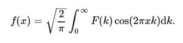

# Python 中的积分、变换、反余弦变换()

> 原文:[https://www . geeksforgeeks . org/sympy-integrations-transforms-inverse _ 余弦-transform-in-python/](https://www.geeksforgeeks.org/sympy-integrals-transforms-inverse_cosine_transform-in-python/)

借助**反余弦变换()**方法，我们可以计算反余弦变换，并使用该方法返回未赋值的函数。



反余弦函数

> **语法:**反余弦变换(F，k，x，* *提示)
> 
> **返回:**返回未赋值函数。

**示例#1 :**

在这个例子中我们可以看到，通过使用**反余弦变换()**方法，我们能够得到反余弦变换并返回未赋值的函数。

## 蟒蛇 3

```py
# import inverse_cosine_transform
from sympy import inverse_cosine_transform, exp, sqrt, pi
from sympy.abc import x, k, a

# Using inverse_cosine_transform() method
gfg = inverse_cosine_transform(sqrt(2)*a/(sqrt(pi)*(a**2 + k**2)), k, x)

print(gfg)
```

**输出:**

> exp(-a*x)

**例 2 :**

## 蟒蛇 3

```py
# import inverse_cosine_transform
from sympy import inverse_cosine_transform, exp, sqrt, pi
from sympy.abc import x, k, a

# Using inverse_cosine_transform() method
gfg = inverse_cosine_transform(sqrt(2)*a/(sqrt(pi)*(a**2 + k**2)), k, 2)

print(gfg)
```

**输出:**

> exp(-2*a)