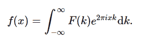

# python 中的积分、变换、逆傅里叶变换()

> 原文:[https://www . geeksforgeeks . org/sympy-integrations-transforms-inverse _ Fourier _ transform-in-python/](https://www.geeksforgeeks.org/sympy-integrals-transforms-inverse_fourier_transform-in-python/)

借助**傅里叶逆变换()**方法，我们可以计算傅里叶逆变换并返回未赋值的函数。



傅里叶逆变换

> **语法:**傅里叶逆变换(F，k，x，* *提示)
> 
> **返回:**返回未赋值函数。

**示例#1 :**

在这个例子中，我们可以看到，通过使用**逆傅里叶变换()**方法，我们能够计算逆傅里叶变换，通过使用该方法返回未赋值的函数。

## 蟒蛇 3

```
# import inverse_fourier_transform
from sympy import inverse_fourier_transform, exp, sqrt, pi
from sympy.abc import x, k

# Using inverse_fourier_transform()
gfg = inverse_fourier_transform(sqrt(pi)*exp(-(pi * k)**2), k, x)

print(gfg)
```

**输出:**

> exp(-x**2)

**例 2 :**

## 蟒蛇 3

```
# import inverse_fourier_transform
from sympy import inverse_fourier_transform, exp, sqrt, pi
from sympy.abc import x, k

# Using inverse_fourier_transform()
gfg = inverse_fourier_transform(sqrt(pi)*exp(-(pi * k)**2), k, 4)

print(gfg)
```

**输出:**

> exp(-16)