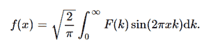

# python 中的积分、变换、逆正弦变换()

> 原文:[https://www . geesforgeks . org/sympy-integrations-transforms-inverse _ sine-transform-in-python/](https://www.geeksforgeeks.org/sympy-integrals-transforms-inverse_sine_transform-in-python/)

借助**逆正弦变换()**方法，我们可以计算逆正弦变换并返回未赋值的函数。



逆正弦变换

> **语法:**逆正弦变换(F，k，x，* *提示)
> 
> **返回:**返回未赋值函数。

**示例#1 :**

在这个例子中我们可以看到，通过使用**逆正弦变换()**方法，我们能够计算逆正弦变换并返回赋值函数。

## 蟒蛇 3

```py
# import inverse_sine_transform
from sympy import inverse_sine_transform, exp, sqrt, gamma, pi
from sympy.abc import x, k, a

# Using inverse_sine_transform() method
gfg = inverse_sine_transform(2**((1-2 * a)/2)*k**(a - 1)*gamma(-a / 2 + 1)/gamma((a + 1)/2), k, x)

print(gfg)
```

**输出:**

> x**(-a)

**例 2 :**

## 蟒蛇 3

```py
# import inverse_sine_transform
from sympy import inverse_sine_transform, exp, sqrt, gamma, pi
from sympy.abc import x, k, a

# Using inverse_sine_transform() method
gfg = inverse_sine_transform(2**((1-2 * a)/2)*k**(a - 1)*gamma(-a / 2 + 1)/gamma((a + 1)/2), k, 3)

print(gfg)
```

**输出:**

> (1/3)**a