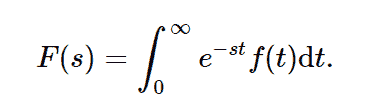

# python 中的积分、变换、拉普拉斯变换()

> 原文:[https://www . geesforgeks . org/sympy-integrations-transforms-拉普拉斯 _transform-in-python/](https://www.geeksforgeeks.org/sympy-integrals-transforms-laplace_transform-in-python/)

借助**拉普拉斯变换()**方法，可以计算出 f(t)的拉普拉斯变换 F(s)。



> **语法:**拉普拉斯变换(f，t，s)
> 返回:返回拉普拉斯变换和收敛条件。

**示例#1 :**
在这个示例中，我们可以看到，通过使用拉普拉斯变换()方法，我们能够计算拉普拉斯变换并返回变换和收敛条件。

## 蟒蛇 3

```py
# import laplace_transform
from sympy.integrals import laplace_transform
from sympy.abc import t, s, a

# Using laplace_transform() method
gfg = laplace_transform(t**a, t, s)

print(gfg)
```

**输出:**

> (s * *(-a)*γ(a+1)/s，0，a > -1)

**例 2 :**

## 蟒蛇 3

```py
# import laplace_transform
from sympy.integrals import laplace_transform
from sympy.abc import t, s, a

# Using laplace_transform() method
gfg = laplace_transform(t**a, t, 5)

print(gfg)
```

**输出:**

> (5 * *(-a)*γ(a+1)/5，0，a > -1)