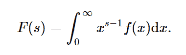

# python 中的 symy . integrations . transforms . mellin _ transform()

> 原文:[https://www . geesforgeks . org/sympy-integrations-transforms-mellin _ transform-in-python/](https://www.geeksforgeeks.org/sympy-integrals-transforms-mellin_transform-in-python/)

借助`**transforms.mellin_transform()**`方法，我们可以计算出 f(x)的梅林变换 F(s)。



> **语法:** `transforms.mellin_transform(f, x, s)`
> **返回:**返回基本条带和辅助收敛条件。

**示例#1 :**
在这个示例中，我们可以看到，通过使用`transforms.mellin_transform()`方法，我们能够计算梅林变换，并返回基本条带和辅助收敛条件。

```py
# import mellin_transform
from sympy.integrals.transforms import mellin_transform
from sympy import exp
from sympy.abc import x, s

# Using mellin_transform() method
gfg = mellin_transform(exp(-x), x, s)

print(gfg)
```

**输出:**

> (γ(s)，(0，oo)，真)

**例 2 :**

```py
# import mellin_transform
from sympy.integrals.transforms import mellin_transform
from sympy import exp
from sympy.abc import x, s

# Using mellin_transform() method
gfg = mellin_transform(exp(-x), x, 3)

print(gfg)
```

**输出:**

> (2，(0，oo)，真)