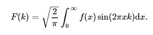

# python 中的症状积分变换正弦变换

> 原文:[https://www . geesforgeks . org/sympy-integrations-transforms-sine _ transform-in-python/](https://www.geeksforgeeks.org/sympy-integrals-transforms-sine_transform-in-python/)

借助 **sine_transform()** 方法，利用该方法得到变换后的函数，即可计算出正弦变换。



正弦变换

> **语法:**正弦变换(f，x，k，* *提示)
> 
> **返回:**返回转换后的函数。

**示例#1 :**

在这个例子中我们可以看到，通过使用 **sine_transform()** 方法，我们能够计算正弦变换并返回变换后的函数。

## 蟒蛇 3

```
# import sine_transform
from sympy import sine_transform, exp
from sympy.abc import x, k, a

# Using sine_transform() method
gfg = sine_transform(x * exp(-a * x**2), x, k)

print(gfg)
```

**输出:**

> sqrt(2)* k * exp(-k * * 2/(4 * a))/(4 * a * *(3/2))

**例 2 :**

## 蟒蛇 3

```
# import sine_transform
from sympy import sine_transform, exp
from sympy.abc import x, k, a

# Using sine_transform() method
gfg = sine_transform(x * exp(-a * x**2), x, 4)

print(gfg)
```

**输出:**

> sqrt(2)*exp(-4/a)/a**(3/2)