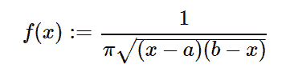

# Python 中的 sympy.stats.Arcsin()

> 原文:[https://www.geeksforgeeks.org/sympy-stats-arcsin-in-python/](https://www.geeksforgeeks.org/sympy-stats-arcsin-in-python/)

借助`**sympy.stats.Arcsin()**`方法，我们可以得到代表反正弦分布的随机变量。



> **语法:** `sympy.stats.Arcsin(name, a, b)`
> 在哪里，它必须持有条件-oo < a < b < +oo。
> **返回:**返回随机变量。

**例#1 :**
在这个例子中我们可以看到，通过使用`sympy.stats.Arcsin()`方法，我们能够通过使用这个方法得到反正弦分布。

```py
# Import sympy and Arcsin
from sympy.stats import Arcsin, density
from sympy import Symbol, simplify

a = Symbol("a", real = True)
b = Symbol("b", real = True)
z = Symbol("z")

# Using sympy.stats.Arcsin() method
X = Arcsin("x", a, b)
gfg = density(X)(z)

print(gfg)
```

**输出:**

> 1/(pi * sqrt((-a+z)*(b–z)))

**例 2 :**

```py
# Import sympy and Arcsin
from sympy.stats import Arcsin, density
from sympy import Symbol, simplify

a = -4
b = 8
z = Symbol("z")

# Using sympy.stats.Arcsin() method
X = Arcsin("x", a, b)
gfg = density(X)(z)

print(gfg)
```

**输出:**

> 1/(pi * sqrt((8–z)*(z+4))