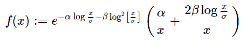

# Python 中的 sympy.stats.Benini()

> 原文:[https://www.geeksforgeeks.org/sympy-stats-benini-in-python/](https://www.geeksforgeeks.org/sympy-stats-benini-in-python/)

借助 **sympy.stats.Benini()** 方法，可以得到代表 Benini 分布的连续随机变量。



> **语法:** sympy.stats.Benini(name，alpha，beta，sigma)
> 其中，alpha，beta，sigma 为实数，大于 0。
> 
> **返回:**返回连续随机变量。

**示例#1 :**

在这个例子中，我们可以看到，通过使用 sympy.stats.Benini()方法，我们能够通过使用这个方法得到代表 Benini 分布的连续随机变量。

## 蟒蛇 3

```py
# Import sympy and Benini
from sympy.stats import Benini, density, cdf
from sympy import Symbol, simplify, pprint

alpha = Symbol("alpha", positive = True)
beta = Symbol("beta", positive = True)
sigma = Symbol("sigma", positive = True)
z = Symbol("z")

# Using sympy.stats.Benini() method
X = Benini("x", alpha, beta, sigma)
GFG = density(X)(z)

pprint(GFG, use_unicode = False)
```

**输出:**

> //z \ \/z \ 2/z \
> | 2 * beta * log |–alpha * log |–beta * log |–beta * log |–t1 | | alpha \ sigma/| \ sigma/\ sigma/
> |–+––––––| * e
> \ z/

**例 2 :**

## 蟒蛇 3

```py
# Import sympy and Benini
from sympy.stats import Benini, density, cdf
from sympy import Symbol, simplify, pprint

alpha = 4
beta = 6
sigma = 3
z = 0.2

# Using sympy.stats.Benini() method
X = Benini("x", alpha, beta, sigma)
GFG = density(X)(z)

pprint(GFG, use_unicode = False)
```

**输出:**

> -5.60587100451865e-13