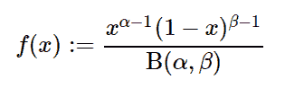

# Python 中的 sympy.stats.Beta()

> 原文:[https://www.geeksforgeeks.org/sympy-stats-beta-in-python/](https://www.geeksforgeeks.org/sympy-stats-beta-in-python/)

借助`**sympy.stats.Beta()**`方法，我们可以得到代表β分布的连续随机变量。



> **语法:** `sympy.stats.Beta(name, alpha, beta)`
> 其中，α和β大于 0。
> **返回:**返回连续随机变量。

**例#1 :**
在这个例子中我们可以看到，通过使用`sympy.stats.Beta()`方法，我们能够通过使用这个方法得到代表β分布的连续随机变量。

```py
# Import sympy and beta
from sympy.stats import Beta, density, E, variance
from sympy import Symbol, simplify, pprint, factor

alpha = Symbol("alpha", positive = True)
beta = Symbol("beta", positive = True)
z = Symbol("z")

# Using sympy.stats.Beta() method
X = Beta("x", alpha, beta)
gfg = density(X)(z)

pprint(gfg, use_unicode = False)
```

**输出:**

> alpha–1 beta–1
> z *(1–z)
> ———————
> b(alpha，beta)

**例 2 :**

```py
# Import sympy and beta
from sympy.stats import Beta, density, E, variance
from sympy import Symbol, simplify, pprint, factor

alpha = 4
beta = 5
z = Symbol("z")

# Using sympy.stats.Beta() method
X = Beta("x", alpha, beta)
gfg = density(X)(z)

pprint(gfg, use_unicode = False)
```

**输出:**

> 3 4
> z *(1–z)
> ——
> B(4，5)