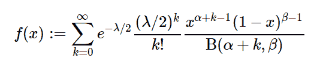

# 很好。stats.BetaNoncentral()在 Python

中

> 原文:[https://www . geeksforgeeks . org/sympy-stats-beta noncentral-in-python/](https://www.geeksforgeeks.org/sympy-stats-betanoncentral-in-python/)

借助`**sympy.stats.BetaNoncentral()**`方法，我们可以得到代表 I 型非中心β分布的连续随机变量。



> **语法:** `sympy.stats.BetaNoncentral()`
> 其中α和β是大于 0 的实数。
> λ大于或等于 0。
> **返回:**返回随机变量。

**例#1 :**
在这个例子中我们可以看到，通过使用`sympy.stats.BetaNoncentral()`方法，我们能够通过使用这个方法得到代表非中心β分布的连续随机变量。

```py
# Import sympy and betanoncentral
from sympy.stats import BetaNoncentral, density
from sympy import Symbol, pprint

alpha = Symbol("alpha", positive = True)
beta = Symbol("beta", positive = True)
lamda = Symbol("lamda", nonnegative = True)
z = Symbol("z")

# Using sympy.stats.BetaNoncentral() method
X = BetaNoncentral("x", alpha, beta, lamda)
gfg = density(X)(z)

pprint(gfg, use_unicode = False)
```

**输出:**

> oo〔〕t0〕〔t1〕〔t1〕〔lam MDA〕〔T3〕\ k〕-〔T4〕-〔k+alpha-〕1/lam MDA \ beta–1 2
> z * |〕-*(1–z)* e【
> /\ 2/
> /---〕
> /--，
> k = 0

**例 2 :**

```py
# Import sympy and betanoncentral
from sympy.stats import BetaNoncentral, density
from sympy import Symbol, pprint

alpha = 4
beta = 5
lamda = 1

# Using sympy.stats.BetaNoncentral() method
X = BetaNoncentral("x", alpha, beta, lamda)
gfg = density(X)(2)

pprint(gfg, use_unicode = False)
```

**输出:**

> oo
> _ _ _ _
> \ `
> \-k+3-1/2
> \ 2 * 2 * e
> /———————
> /B(k+4，5)*k！
> /___、
> k = 0