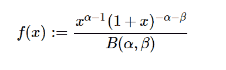

# 很好。stats.BetaPrime()用 Python

> 哎哎哎:# t0]https://www . geeksforgeeks . org/symy-stats-beta prime-in-python/

借助`**sympy.stats.BetaPrime()**`方法，我们可以得到代表β素分布的连续随机变量。



> **语法:** `sympy.stats.BetaPrime(name, alpha, beta)`
> **返回:**返回连续随机变量。

**示例#1 :**
在这个示例中，我们可以看到，通过使用`sympy.stats.BetaPrime()`方法，我们能够使用该方法获得表示β素分布的连续随机变量。

```py
# Import sympy and betaprime
from sympy.stats import BetaPrime, density
from sympy import Symbol, pprint

alpha = Symbol("alpha", positive = True)
beta = Symbol("beta", positive = True)
z = Symbol("z")

# Using sympy.stats.BetaPrime() method
X = BetaPrime("x", alpha, beta)
gfg = density(X)(z)

pprint(gfg, use_unicode = False)
```

**输出:**

> alpha–1-alpha–beta
> z *(z+1)
> ———————
> b(alpha，beta)

**例 2 :**

```py
# Import sympy and betaprime
from sympy.stats import BetaPrime, density
from sympy import Symbol, pprint

alpha = 4
beta = 5
z = Symbol("z")

# Using sympy.stats.BetaPrime() method
X = BetaPrime("x", alpha, beta)
gfg = density(X)(z)

pprint(gfg, use_unicode = False)
```

**输出:**

> 3
> z
> ———
> 9
> (z+1)* B(4，5)