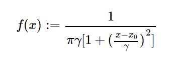

# Python 中的 sympy.stats.Cauchy()

> 原文:[https://www.geeksforgeeks.org/sympy-stats-cauchy-in-python/](https://www.geeksforgeeks.org/sympy-stats-cauchy-in-python/)

借助`**sympy.stats.Cauchy()**`方法，我们可以得到代表柯西分布的连续随机变量。



> **语法:** `sympy.stats.Cauchy(name, x, gamma)`
> 其中，x 和γ是实数，γ大于 0。
> **返回:**返回连续随机变量。

**例#1 :**
在这个例子中我们可以看到，通过使用`sympy.stats.Cauchy()`方法，我们能够通过使用这个方法得到代表柯西分布的连续随机变量。

```py
# Import sympy and cauchy
from sympy.stats import Cauchy, density
from sympy import Symbol

x0 = Symbol("x0")
gamma = Symbol("gamma", positive = True)
z = Symbol("z")

# Using sympy.stats.Cauchy() method
X = Cauchy("x", x0, gamma)
gfg = density(X)(z)

print(gfg)
```

**输出:**

> 1/(pi * gamma *(1+(-0x 0+z)* * 2/gamma * * 2))

**例 2 :**

```py
# Import sympy and cauchy
from sympy.stats import Cauchy, density
from sympy import Symbol

x0 = 2
gamma = 3
z = 0.5

# Using sympy.stats.Cauchy() method
X = Cauchy("x", x0, gamma)
gfg = density(X)(z)

print(gfg)
```

**输出:**

> 0.2666666666666666/pi