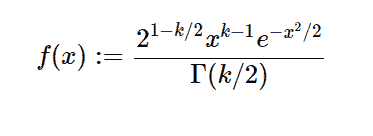

# Python 中的 sympy.stats.Chi()

> 原文:[https://www.geeksforgeeks.org/sympy-stats-chi-in-python/](https://www.geeksforgeeks.org/sympy-stats-chi-in-python/)

借助`**sympy.stats.Chi()**`方法，我们可以得到代表 chi 分布的连续随机变量。



> **语法:** `sympy.stats.Chi(name, k)`
> 其中，k 为自由度数。
> **返回:**返回连续随机变量。

**示例#1 :**
在这个示例中，我们可以看到，通过使用`sympy.stats.Chi()`方法，我们能够使用该方法获得表示 chi 分布的连续随机变量。

```py
# Import sympy and chi
from sympy.stats import Chi, density, E
from sympy import Symbol, simplify

k = Symbol("k", integer = True)
z = Symbol("z")

# Using sympy.stats.Chi() method
X = Chi("x", k)
gfg = density(X)(z)

print(gfg)
```

**输出:**

> 2 * *(1–k/2)* z * *(k–1)* exp(-z * * 2/2)/gamma(k/2)

**例 2 :**

```py
# Import sympy and chi
from sympy.stats import Chi, density, E
from sympy import Symbol, simplify

k = 3
z = 2

# Using sympy.stats.Chi() method
X = Chi("x", k)
gfg = density(X)(z)

print(gfg)
```

**输出:**

> 4*sqrt(2)*exp(-2)/sqrt(pi)