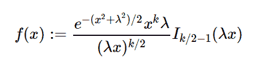

# Python 中的 sympy.stats.ChiNoncentral()

> 原文:[https://www . geesforgeks . org/sympy-stats-chinoncentral-in-python/](https://www.geeksforgeeks.org/sympy-stats-chinoncentral-in-python/)

借助`**sympy.stats.ChiNoncentral()**`方法，我们可以得到代表非中心 chi 分布的连续随机变量。



> **语法:** `sympy.stats.ChiNoncentral(name, k, l)`
> 其中，k 和 l 为自由度数。
> **返回:**返回连续随机变量。

**例#1 :**
在这个例子中我们可以看到，通过使用`sympy.stats.ChiNoncentral()`方法，我们能够利用这个方法得到代表非中心 chi 分布的连续随机变量。

```
# Import sympy and ChiNoncentral
from sympy.stats import ChiNoncentral, density, E
from sympy import Symbol, simplify

k = Symbol("k", integer = True)
l = Symbol("l", integer = True)
z = Symbol("z")

# Using sympy.stats.ChiNoncentral() method
X = ChiNoncentral("x", k, l)
gfg = density(X)(z)

pprint(gfg)
```

**输出:**

> 2 2
> -k l z
> —–—
> k 2 2/k \
> l * z *(l * z)* e * besseli |-–1，l*z|
> \2 /

**例 2 :**

```
# Import sympy and ChiNoncentral
from sympy.stats import ChiNoncentral, density, E
from sympy import Symbol, simplify

k = 5
l = 6
z = 0.2

# Using sympy.stats.ChiNoncentral() method
X = ChiNoncentral("x", k, l)
gfg = density(X)(z)

print(gfg)
```

**输出:**

> 1.81702770690497e-11 *贝塞利(3/2，1.2)