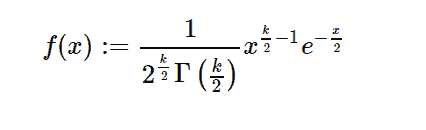

# python 中的 sympy.stats.ChiSquared()

> 原文:[https://www . geesforgeks . org/sympy-stats-chisquared-in-python/](https://www.geeksforgeeks.org/sympy-stats-chisquared-in-python/)

借助`**sympy.stats.ChiSquared()**`方法，我们可以得到代表卡方分布的连续随机变量。



> **语法:** `sympy.stats.ChiSquared(name, k)`
> **返回:**返回连续随机变量。

**例#1 :**
在这个例子中我们可以看到，通过使用`sympy.stats.ChiSquared()`方法，我们能够通过使用这个方法得到代表卡方分布的连续随机变量。

```py
# Import sympy and chisquared
from sympy.stats import ChiSquared, density
from sympy import Symbol

k = Symbol("k", integer = True, positive = True)
z = Symbol("z")

# Using sympy.stats.ChiSquared() method
X = ChiSquared("x", k)
gfg = density(X)(z)

pprint(gfg)
```

**输出:**

> -k-z
> ———1–
> 【2 2】
> 【2 * z * e】
> ————————
> /k \
> 【gamma |-|
> \ 2/

**例 2 :**

```py
# Import sympy and chisquared
from sympy.stats import ChiSquared, density
from sympy import Symbol

k = 3
z = 2

# Using sympy.stats.ChiSquared() method
X = ChiSquared("x", k)
gfg = density(X)(z)

pprint(gfg)
```

**输出:**

> -1
> e
> —
> _ _ _ _
> \/pi