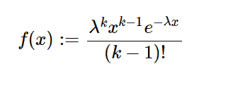

# python 中的 sympy . stats . Erlang()

> 原文:[https://www.geeksforgeeks.org/sympy-stats-erlang-in-python/](https://www.geeksforgeeks.org/sympy-stats-erlang-in-python/)

借助`**sympy.stats.Erlang()**`方法，我们可以得到代表 erlang 分布的连续随机变量。


> **语法:** `sympy.stats.Erlang(name, k, l)`
> 其中，k 为正整数，l 为大于 0 的实数。
> **返回:**返回连续随机变量。

**示例#1 :**
在这个示例中我们可以看到，通过使用`sympy.stats.Erlang()`方法，我们能够通过使用该方法获得代表二郎分布的连续随机变量。

```
# Import sympy and Erlang
from sympy.stats import Erlang, density
from sympy import Symbol

k = Symbol("k", integer = True, positive = True)
l = Symbol("l", integer = True, positive = True)
z = Symbol("z")

# Using sympy.stats.Erlang() method
X = Erlang("x", k, l)
gfg = density(X)(z)

pprint(gfg)
```

**输出:**

> k-1-l * z
> l * z * e
> ——
> gamma(k)

**例 2 :**

```
# Import sympy and Erlang
from sympy.stats import Erlang, density
from sympy import Symbol

k = 2
l = 3
z = 1

# Using sympy.stats.Erlang() method
X = Erlang("x", k, l)
gfg = density(X)(z)

pprint(gfg)
```

**输出:**

> -3
> 9*e