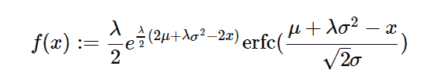

# python 中的 sympy.stats.ExGaussian()

> 原文:[https://www . geesforgeks . org/sympy-stats-ex Gaussian-in-python/](https://www.geeksforgeeks.org/sympy-stats-exgaussian-in-python/)

借助`**sympy.stats.ExGaussian()**`方法，我们可以得到代表指数修正高斯分布的连续随机变量。



> **语法:** `sympy.stats.ExGaussian(name, mean, std, rate)`
> **返回:**返回连续随机变量。

**示例#1 :**
在这个示例中，我们可以看到，通过使用`sympy.stats.ExGaussian()`方法，我们能够使用该方法获得代表指数修正高斯分布的连续随机变量。

```
# Import sympy and ExGaussian
from sympy.stats import ExGaussian, density
from sympy import Symbol

mean = Symbol("mean", integer = True, positive = True)
std = Symbol("std", integer = True, positive = True)
rate = Symbol("rate", integer = True, positive = True)
z = Symbol("z")

# Using sympy.stats.ExGaussian() method
X = ExGaussian("x", mean, std, rate)
gfg = density(X)(z)

pprint(gfg)
```

**输出:**

> / 2 \
> 比率* \ 2 *平均值+比率*标准–2 * z/
> ——————————/ _ _ _/2 \ \
> 2 | \/2 * \平均值+比率*标准–z/|
> 比率* e * erfc | ——————————————————————————|
> \ 2 *标准/
> ——————————————————————————————————————————————————T6】2

**例 2 :**

```
# Import sympy and ExGaussian
from sympy.stats import ExGaussian, density
from sympy import Symbol

mean = 22
std = 21
rate = 7
z = 0.4

# Using sympy.stats.ExGaussian() method
X = ExGaussian("x", mean, std, rate)
gfg = density(X)(z)

pprint(gfg)
```

**输出:**

> /_ _ _ _ _ _ _ _ _ t 0]3.50044698618837 e+4758 * erfc \ 74.0142857142857 * \/2/