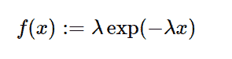

# python 中的 sympy . stats . index()

> 原文:[https://www . geeksforgeeks . org/sympy-stats-index-in-python/](https://www.geeksforgeeks.org/sympy-stats-exponential-in-python/)

借助`**sympy.stats.Exponential()**`方法，我们可以得到代表指数分布的连续随机变量。



> **语法:** `sympy.stats.Exponential(name, rate)`
> **返回:**返回连续随机变量。

**例#1 :**
在这个例子中我们可以看到，通过使用`sympy.stats.Exponential()`方法，我们能够通过使用这个方法得到代表指数分布的连续随机变量。

```
# Import sympy and Exponential
from sympy.stats import Exponential, density
from sympy import Symbol

rate = Symbol("rate", integer = True, positive = True)
z = Symbol("z")

# Using sympy.stats.Exponential() method
X = Exponential("x", rate)
gfg = density(X)(z)

pprint(gfg)
```

**输出:**

> -速率*z
> 速率*e

**例 2 :**

```
# Import sympy and Exponential
from sympy.stats import Exponential, density
from sympy import Symbol

rate = 5
z = 0.5

# Using sympy.stats.Exponential() method
X = Exponential("x", rate)
gfg = density(X)(z)

pprint(gfg)
```

**输出:**

> 0.410424993119494