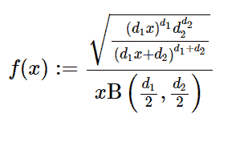

# python 中的 sympy . stats . fddistribution()

> 原文:[https://www . geeksforgeeks . org/sympy-stats-FD distribution-in-python/](https://www.geeksforgeeks.org/sympy-stats-fdistribution-in-python/)

借助`**sympy.stats.FDistribution()**`方法，我们可以得到代表 F 分布的连续随机变量。


> **语法:** `sympy.stats.FDistribution(name, d1, d2)`
> 其中，d1 和 d2 表示自由度。
> **返回:**返回连续随机变量。

**例#1 :**
在这个例子中我们可以看到，通过使用`sympy.stats.FDistribution()`方法，我们能够通过使用这个方法得到代表 F 分布的连续随机变量。

```py
# Import sympy and FDistribution
from sympy.stats import FDistribution, density
from sympy import Symbol

d1 = Symbol("d1", integer = True, positive = True)
d2 = Symbol("d2", integer = True, positive = True)
z = Symbol("z")

# Using sympy.stats.FDistribution() method
X = FDistribution("x", d1, d2)
gfg = density(X)(z)

pprint(gfg)
```

**输出:**

> D2
> —_ _ _ _ _ _ _ _ _ _ _ _ _ _ _ _
> 2/D1-D1–D2
> D2 * \/(D1 * z)*(D1 * z+D2)
> ————————
> /D1 D2 \
> z * B |–|
> \ 2 2/

**例 2 :**

```py
# Import sympy and FDistribution
from sympy.stats import FDistribution, density
from sympy import Symbol

d1 = 5
d2 = 6
z = 1

# Using sympy.stats.FDistribution() method
X = FDistribution("x", d1, d2)
gfg = density(X)(z)

pprint(gfg)
```

**输出:**

> _ _ _ _
> 5400 * \/55
> ———
> 1771561 * B(5/2，3)