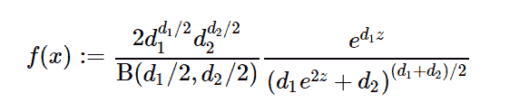

# python 中的 sympy . stats . fisherz()

> 原文:[https://www . geesforgeks . org/sympy-stats-fisher z-in-python/](https://www.geeksforgeeks.org/sympy-stats-fisherz-in-python/)

借助`**sympy.stats.FisherZ()**`方法，我们可以得到代表费希尔 Z 分布的连续随机变量。


> **语法:** `sympy.stats.FisherZ(name, d1, d2)`
> 其中，d1 和 d2 表示自由度。
> **返回:**返回连续随机变量。

**示例#1 :**
在这个示例中，我们可以看到，通过使用`sympy.stats.FisherZ()`方法，我们能够使用该方法获得代表费希尔 Z 分布的连续随机变量。

```
# Import sympy and FisherZ
from sympy.stats import FisherZ, density
from sympy import Symbol

d1 = Symbol("d1", integer = True, positive = True)
d2 = Symbol("d2", integer = True, positive = True)
z = Symbol("z")

# Using sympy.stats.FisherZ() method
X = FisherZ("x", d1, d2)
gfg = density(X)(z)

pprint(gfg)
```

**输出:**

> D1 D2
> D1 D2–—–—
> ——2 2
> 2 2/2 * z \ D1 * z
> 2 * D1 * D2 * \ D1 * e+D2/* e
> ———2——2——2
> /D1 D2 \
> B |–、–|
> \ 2/

**例 2 :**

```
# Import sympy and FisherZ
from sympy.stats import FisherZ, density
from sympy import Symbol

d1 = 2
d2 = 3
z = 0.5

# Using sympy.stats.FisherZ() method
X = FisherZ("x", d1, d2)
gfg = density(X)(z)

pprint(gfg)
```

**输出:**

> _ _ _ _ _ _
> 0.236675344303001 * \/3