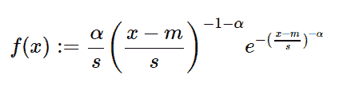

# python 中的 sympy.stats.Frechet()

> 原文:[https://www . geesforgeks . org/sympy-stats-frechet-in-python/](https://www.geeksforgeeks.org/sympy-stats-frechet-in-python/)

借助`**sympy.stats.Frechet()**`方法，我们可以得到代表弗雷歇分布的连续随机变量。


> **句法:** `sympy.stats.Frechet(name, a, s=1, m=0)`
> 其中，a、s、m 表示实数。
> **返回:**返回连续随机变量。

**例#1 :**
在这个例子中我们可以看到，通过使用`sympy.stats.Frechet()`方法，我们能够通过使用这个方法得到代表弗雷切特分布的连续随机变量。

```py
# Import sympy and Frechet
from sympy.stats import Frechet, density
from sympy import Symbol

a = Symbol("a", integer = True, positive = True)
s = Symbol("s", integer = True, positive = True)
m = Symbol("m", integer = True, positive = True)
z = Symbol("z")

# Using sympy.stats.Frechet() method
X = Frechet("x", a, s, m)
gfg = density(X)(z)

pprint(gfg)
```

**输出:**

> -a
> /-m+z \
> -a–1-|—|
> /-m+z \ \ s/
> a * |—| * e
> \ s/
> ———————
> s

**例 2 :**

```py
# Import sympy and Frechet
from sympy.stats import Frechet, density
from sympy import Symbol

a = 3
s = 1
m = -2
z = Symbol("z")

# Using sympy.stats.Frechet() method
X = Frechet("x", a, s, m)
gfg = density(X)(z)

pprint(gfg)
```

**输出:**

> -1
> —
> 3
> (z+2)
> 3 * e
> —
> 4
> (z+2)