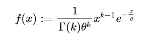

# Python 中的 sympy.stats.Gamma()函数

> 原文:[https://www . geesforgeks . org/sympy-stats-gamma-function-in-python/](https://www.geeksforgeeks.org/sympy-stats-gamma-function-in-python/)

借助 **sympy.stats.Gamma()** 方法，我们可以创建一个 Gamma 分布的连续随机变量。伽马分布的密度由下式给出



**x 在[0，1]中。**

```py
Syntax:  sympy.stats.Gamma(name, k, theta)

Parameters:
 k: real number, k>0
 theta:  real number, theta>0

Returns: a continuous random variable with a Gamma distribution.

```

**示例#1 :**

## 蟒蛇 3

```py
# import sympy, Gamma, density, Symbol, pprint
from sympy.stats import Gamma, density
from sympy import Symbol, pprint

k = Symbol("k", positive = True)
theta = Symbol("theta", positive = True)
z = Symbol("z")

# using sympy.stats.Gamma() method
X = Gamma("x", k, theta)
gamVar = density((X)(z))

pprint(gamVar)
```

**输出:**

```py
                 -z  
                -----
     -k  k - 1  theta
theta  *z     *e     
---------------------
       Gamma(k)  
```

**例 2 :**

## 蟒蛇 3

```py
# import sympy, Gamma, density, Symbol, pprint
from sympy.stats import Gamma, density
from sympy import Symbol, pprint

z = Symbol("z")

# using sympy.stats.Gamma() method
X = Gamma("x", 1 / 3, 45)
gamVar = density((X)(z))

pprint(gamVar)
```

**输出:**

```py
           -z     
           ---    
   3 ____   45    
   \/ 75 *e       
------------------
    2/3           
15*z   *Gamma(1/3)
```