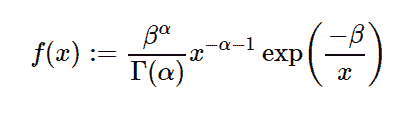

# 不错。stats . gammainverse()用 python

> 哎哎哎:# t0]https://www . geeksforgeeks . org/symy-stats-gamma reverse-in-python/

借助`**sympy.stats.GammaInverse()**`方法，我们可以得到表示逆伽马分布的连续随机变量。



> **语法:** `sympy.stats.GammaInverse(name, a, b)`
> 其中，a 和 b 表示实数。
> **返回:**返回连续随机变量。

**示例#1 :**
在这个示例中，我们可以看到，通过使用`sympy.stats.GammaInverse()`方法，我们能够使用该方法获得表示逆伽马分布的连续随机变量。

```py
# Import sympy and GammaInverse
from sympy.stats import GammaInverse, density
from sympy import Symbol

a = Symbol("a", integer = True, positive = True)
b = Symbol("b", integer = True, positive = True)
z = Symbol("z")

# Using sympy.stats.GammaInverse() method
X = GammaInverse("x", a, b)
gfg = density(X)(z)

pprint(gfg)
```

**输出:**

> -b
> ——
> a-a–1z
> b * z * e
> ——
> gamma(a)

**例 2 :**

```py
# Import sympy and GammaInverse
from sympy.stats import GammaInverse, density
from sympy import Symbol

a = 4
b = 3
z = 2

# Using sympy.stats.GammaInverse() method
X = GammaInverse("x", a, b)
gfg = density(X)(z)

pprint(gfg)
```

**输出:**

> -3/2
> 27 * e
> —
> 64