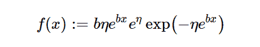

# python 中的 sympy . stats . Gompertz()

> 原文:[https://www . geesforgeks . org/sympy-stats-gompertz-in-python/](https://www.geeksforgeeks.org/sympy-stats-gompertz-in-python/)

借助`**sympy.stats.Gompertz()**`方法，我们可以得到代表 Gompertz 分布的连续随机变量。



> **语法:** `sympy.stats.Gompertz(name, b, eta)`
> 其中，b 和 eta 表示实数。
> **返回:**返回连续随机变量。

**例#1 :**
在这个例子中我们可以看到，通过使用`sympy.stats.Gompertz()`方法，我们能够通过使用这个方法得到代表 Gompertz 分布的连续随机变量。

```
# Import sympy and Gompertz
from sympy.stats import Gompertz, density
from sympy import Symbol

b = Symbol("b", integer = True, positive = True)
eta = Symbol("eta", integer = True, positive = True)
z = Symbol("z")

# Using sympy.stats.Gompertz() method
X = Gompertz("x", b, eta)
gfg = density(X)(z)

pprint(gfg)
```

**输出:**

> b * z
> eta b * z-eta * e
> b * eta * e * e * e *

**例 2 :**

```
# Import sympy and Gompertz
from sympy.stats import Gompertz, density
from sympy import Symbol

b = 2
eta = 4
z = 2

# Using sympy.stats.Gompertz() method
X = Gompertz("x", b, eta)
gfg = density(X)(z)

pprint(gfg)
```

**输出:**

> 4
> 8 -4*e
> 8*e *e