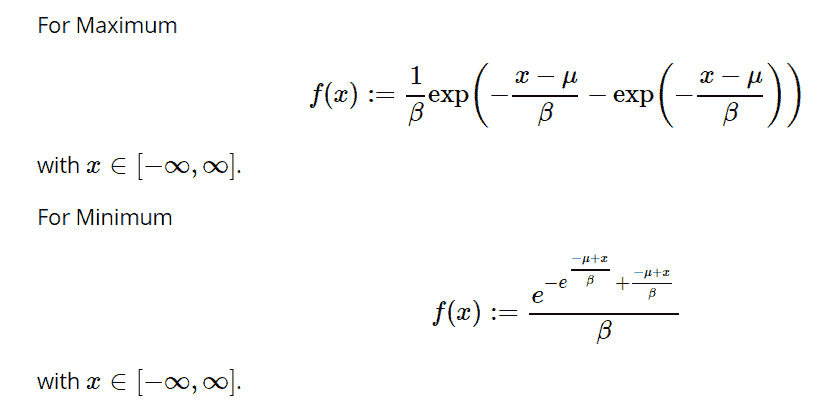

# python 中的 sympy . stats . Gumbel()

> 原文:[https://www.geeksforgeeks.org/sympy-stats-gumbel-in-python/](https://www.geeksforgeeks.org/sympy-stats-gumbel-in-python/)

借助`**sympy.stats.Gumbel()**`方法，我们可以得到代表 gumbel 分布的连续随机变量。



> **语法:** `sympy.stats.Gumbel(name, beta, mu, minimum=False)`
> 其中，如果我们设置最小值为真，那么我们可以启用最小分布。
> **返回:**返回连续随机变量。

**示例#1 :**
在这个示例中我们可以看到，通过使用`sympy.stats.Gumbel()`方法，我们能够使用该方法获得表示 gumbel 分布的连续随机变量。

```
# Import sympy and gumbel
from sympy.stats import Gumbel, density
from sympy import Symbol, pprint

z = Symbol("z")
mu = Symbol("mu")
beta = Symbol("beta", positive = True)

# Using sympy.stats.Gumbel() method
X = Gumbel("x", beta, mu)
gfg = density(X)(z)

pprint(gfg)
```

**输出:**

> -(-mu+z)
> ——
> β-mu+z
> —e–—
> β
> e
> ————
> β

**例 2 :**

```
# Import sympy and gumbel
from sympy.stats import Gumbel, density
from sympy import Symbol, pprint

z = 0.4
mu = 2
beta = 4

# Using sympy.stats.Gumbel() method
X = Gumbel("x", beta, mu)
gfg = density(X)(z)

pprint(gfg)
```

**输出:**

> 0.0839008899108612