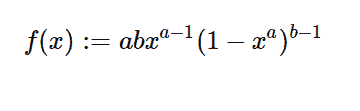

# python 中的 sympy.stats.Kumaraswamy()

> 原文:[https://www . geesforgeks . org/sympy-stats-kumaraswamy-in-python/](https://www.geeksforgeeks.org/sympy-stats-kumaraswamy-in-python/)

借助`**sympy.stats.Kumaraswamy()**`方法，我们可以得到代表 kumaraswamy 分布的连续随机变量。



> **语法:** `sympy.stats.Kumaraswamy(name, a, b)`
> 其中，a 和 b 为实数，a、b >为 0。
> **返回:**返回连续随机变量。

**示例#1 :**
在这个示例中，我们可以看到，通过使用`sympy.stats.Kumaraswamy()`方法，我们能够使用该方法获得表示 kumaraswamy 分布的连续随机变量。

```
# Import sympy and Kumaraswamy
from sympy.stats import Kumaraswamy, density
from sympy import Symbol, pprint

z = Symbol("z")
a = Symbol("a", positive = True)
b = Symbol("b", positive = True)

# Using sympy.stats.Kumaraswamy() method
X = Kumaraswamy("x", a, b)
gfg = density(X)(z)

pprint(gfg)
```

**输出:**

> b–1
> a–1/a \
> a * b * z * \ 1–z/

**例 2 :**

```
# Import sympy and Kumaraswamy
from sympy.stats import Kumaraswamy, density
from sympy import Symbol, pprint

z = 0.3
a = 2
b = 6

# Using sympy.stats.Kumaraswamy() method
X = Kumaraswamy("x", a, b)
gfg = density(X)(z)

pprint(gfg)
```

**输出:**

> 2.24651572236000