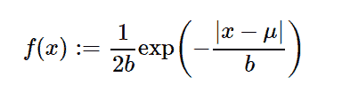

# python 中的 sympy.stats .拉普拉斯()

> 原文:[https://www . geesforgeks . org/sympy-stats-拉普拉斯-in-python/](https://www.geeksforgeeks.org/sympy-stats-laplace-in-python/)

借助`**sympy.stats.Laplace()**`方法，我们可以得到代表拉普拉斯分布的连续随机变量。



> **语法:** `sympy.stats.Laplace(name, mu, b)`
> 其中，μ和 b 为实数，μ、b >为 0。
> **返回:**返回连续随机变量。

**例#1 :**
在这个例子中我们可以看到，通过使用`sympy.stats.Laplace()`方法，我们能够用这个方法得到代表拉普拉斯分布的连续随机变量。

```py
# Import sympy and Laplace
from sympy.stats import Laplace, density
from sympy import Symbol, pprint

z = Symbol("z")
mu = Symbol("mu", positive = True)
b = Symbol("b", positive = True)

# Using sympy.stats.Laplace() method
X = Laplace("x", mu, b)
gfg = density(X)(z)

pprint(gfg)
```

**输出:**

> -| mu–z |
> —-
> b
> e
> —–
> 2 * b

**例 2 :**

```py
# Import sympy and Laplace
from sympy.stats import Laplace, density
from sympy import Symbol, pprint

z = 0.6
mu = 2
b = 2.5

# Using sympy.stats.Laplace() method
X = Laplace("x", mu, b)
gfg = density(X)(z)

pprint(gfg)
```

**输出:**

> 0.114241812769763