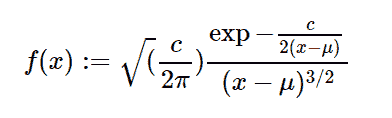

# python 中的 sympy.stats.Levy()

> 原文:[https://www.geeksforgeeks.org/sympy-stats-levy-in-python/](https://www.geeksforgeeks.org/sympy-stats-levy-in-python/)

借助`**sympy.stats.Levy()**`方法，我们可以得到代表征税分布的连续随机变量。


> **句法:** `sympy.stats.Levy(name, mu, c)`
> 其中，μ和 c 为实数，μ、c >为 0。
> **返回:**返回连续随机变量。

**例#1 :**
在这个例子中我们可以看到，通过使用`sympy.stats.Levy()`方法，我们能够通过使用这个方法得到代表利维分布的连续随机变量。

```
# Import sympy and Levy
from sympy.stats import Levy, density
from sympy import Symbol, pprint

z = Symbol("z")
mu = Symbol("mu", positive = True)
c = Symbol("c", positive = True)

# Using sympy.stats.Levy() method
X = Levy("x", mu, c)
gfg = density(X)(z)

pprint(gfg)
```

**输出:**

> sqrt(2)* sqrt(c)* exp(-c)/(2 * mu+2 * z))/(2 * sqrt(pi)*(-mu+z)* *(3/2))

**例 2 :**

```
# Import sympy and Levy
from sympy.stats import Levy, density
from sympy import Symbol, pprint

z = 0.3
mu = 3
c = 2

# Using sympy.stats.Levy() method
X = Levy("x", mu, c)
gfg = density(X)(z)

pprint(gfg)
```

**输出:**

> 0.014240812169263