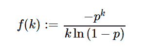

# Python 中的 sympy . stats . log()

> 原文:[https://www . geesforgeks . org/sympy-stats-对数-in-python/](https://www.geeksforgeeks.org/sympy-stats-logarithmic-in-python/)

借助`**sympy.stats.Logarithmic()**`方法，我们可以得到代表对数分布的随机变量。



> **语法:** `sympy.stats.Logarithmic(name, p)`
> **返回:**返回随机变量。

**例#1 :**
在这个例子中我们可以看到，通过使用`sympy.stats.Logarithmic()`方法，我们能够通过使用这个方法得到代表对数分布的随机变量。

```py
# Import sympy and logarithmic
from sympy.stats import Logarithmic, density, E, variance
from sympy import Symbol, S

p = S.One / 5

# Using sympy.stats.Logarithmic() method
X = Logarithmic("x", p)
gfg = density(X)(3)

print(gfg)
```

**输出:**

> -1/(375*log(4/5))

**例 2 :**

```py
# Import sympy and logarithmic
from sympy.stats import Logarithmic, density, E, variance
from sympy import Symbol, S

p = 0.46

# Using sympy.stats.Logarithmic() method
X = Logarithmic("x", p)
gfg = density(X)(4)

print(gfg)
```

**输出:**

> 0.0181660042052665