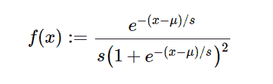

# python 中的 sympy.stats.Logistic()

> 原文:[https://www . geeksforgeeks . org/sympy-stats-logistics-in-python/](https://www.geeksforgeeks.org/sympy-stats-logistic-in-python/)

借助`**sympy.stats.Logistic()**`方法，我们可以得到代表逻辑分布的连续随机变量。



> **句法:** `sympy.stats.Logistic(name, mu, s)`
> 其中，μ和 s 为实数，μ、s >为 0。
> **返回:**返回连续随机变量。

**示例#1 :**
在这个示例中我们可以看到，通过使用`sympy.stats.Logistic()`方法，我们能够通过使用该方法获得表示逻辑斯蒂分布的连续随机变量。

```
# Import sympy and Logistic
from sympy.stats import Logistic, density
from sympy import Symbol, pprint

z = Symbol("z")
mu = Symbol("mu", positive = True)
s = Symbol("s", positive = True)

# Using sympy.stats.Logistic() method
X = Logistic("x", mu, s)
gfg = density(X)(z)

pprint(gfg)
```

**输出:**

> mu–z
> —
> s
> e
> ———
> 2
> /mu–z \
> |—|
> | s |
> s * \ e+1/

**例 2 :**

```
# Import sympy and Logistic
from sympy.stats import Logistic, density
from sympy import Symbol, pprint

z = 0.3
mu = 5
s = 1.3

# Using sympy.stats.Logistic() method
X = Logistic("x", mu, s)
gfg = density(X)(z)

pprint(gfg)
```

**输出:**

> 0.0196269669241977