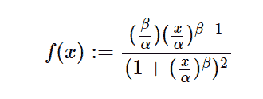

# python 中的 sympy.stats.LogLogistic()

> 原文:[https://www . geesforgeks . org/sympy-stats-loglogistic-in-python/](https://www.geeksforgeeks.org/sympy-stats-loglogistic-in-python/)

借助`**sympy.stats.LogLogistic()**`方法，我们可以得到代表对数-逻辑斯蒂分布的连续随机变量。



> **语法:** `sympy.stats.LogLogistic(name, alpha, beta)`
> 其中，α和β为实数，α、β>为 0。
> **返回:**返回连续随机变量。

**示例#1 :**
在这个示例中，我们可以看到，通过使用`sympy.stats.LogLogistic()`方法，我们能够使用该方法获得表示 Log-Logistic 分布的连续随机变量。

```
# Import sympy and LogLogistic
from sympy.stats import LogLogistic, density
from sympy import Symbol, pprint

z = Symbol("z")
alpha = Symbol("alpha", positive = True)
beta = Symbol("beta", positive = True)

# Using sympy.stats.LogLogistic() method
X = LogLogistic("x", alpha, beta)
gfg = density(X)(z)

pprint(gfg)
```

**输出:**

> beta-1
> /z \
> 【beta * |】-|
> \ alpha/
> ——————————
> 
> /beta \
> |/z \ |
> 【alpha *】-|+1 |
> \ \ alpha//

**例 2 :**

```
# Import sympy and LogLogistic
from sympy.stats import LogLogistic, density
from sympy import Symbol, pprint

z = 1.2
alpha = 2
beta = 3

# Using sympy.stats.LogLogistic() method
X = LogLogistic("x", alpha, beta)
gfg = density(X)(z)

pprint(gfg)
```

**输出:**

> 0.365196502770083