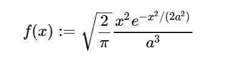

# python 中的 sympy.stats.Maxwell()

> 原文:[https://www . geesforgeks . org/sympy-stats-Maxwell-in-python/](https://www.geeksforgeeks.org/sympy-stats-maxwell-in-python/)

借助`**sympy.stats.Maxwell()**`方法，我们可以得到代表麦克斯韦分布的连续随机变量。



> **语法:** `sympy.stats.Maxwell(name, a)`
> 其中，a 为实数，a 为> 0。
> **返回:**返回连续随机变量。

**例#1 :**
在这个例子中我们可以看到，通过使用`sympy.stats.Maxwell()`方法，我们能够用这个方法得到代表麦克斯韦分布的连续随机变量。

```py
# Import sympy and Maxwell
from sympy.stats import Maxwell, density
from sympy import Symbol, pprint

z = Symbol("z")
a = Symbol("a", positive = True)

# Using sympy.stats.Maxwell() method
X = Maxwell("x", a)
gfg = density(X)(z)

pprint(gfg)
```

**输出:**

> 2
> -z
> ——
> 2
> _ _ _ 2 * a
> \/2 * z * e
> ———
> _ _ _ _ 3
> \/pi * a

**例 2 :**

```py
# Import sympy and Maxwell
from sympy.stats import Maxwell, density
from sympy import Symbol, pprint

z = 1.2
a = 3

# Using sympy.stats.Maxwell() method
X = Maxwell("x", a)
gfg = density(X)(z)

pprint(gfg)
```

**输出:**

> 0.0492328718072872 * \/2
> —————
> _ _ _ _
> \/pi