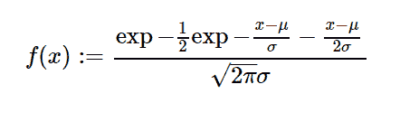

# python 中的 sympy.stats.Moyal()

> 原文:[https://www.geeksforgeeks.org/sympy-stats-moyal-in-python/](https://www.geeksforgeeks.org/sympy-stats-moyal-in-python/)

借助`**sympy.stats.Moyal()**`方法，我们可以得到代表 moyal 分布的连续随机变量。



> **语法:** `sympy.stats.Moyal(name, mu, sigma)`
> 其中，μ和σ为实数。
> **返回:**返回连续随机变量。

**例#1 :**
在这个例子中我们可以看到，通过使用`sympy.stats.Moyal()`方法，我们能够通过使用这个方法得到代表烟雾分布的连续随机变量。

```py
# Import sympy and Moyal
from sympy.stats import Moyal, density
from sympy import Symbol, pprint

z = Symbol("z")
mu = Symbol("mu", positive = True)
sigma = Symbol("sigma", positive = True)

# Using sympy.stats.Moyal() method
X = Moyal("x", mu, sigma)
gfg = density(X)(z)

print(gfg)
```

**输出:**

> sqrt(2)* exp(-exp((mu-z)/sigma)/2(-mu+z)/(2 * sigma))/(2 * sqrt(pi)* sigma)

**例 2 :**

```py
# Import sympy and Moyal
from sympy.stats import Moyal, density, cdf
from sympy import Symbol, pprint

z = Symbol("z")
mu = Symbol("mu", positive = True)
sigma = Symbol("sigma", positive = True)

# Using sympy.stats.Moyal() method
X = Moyal("x", mu, sigma)
Z = density(X)(z)
gfg = simplify(cdf(X)(z))

print(gfg)
```

**输出:**

> 1-ERF(sqrt(2)* exp((mu-z)/(2 * sigma))/2)