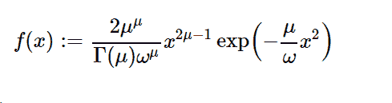

# python 中的 sympy . stats . Nakagami()

> 原文:[https://www . geesforgeks . org/sympy-stats-naka gami-in-python/](https://www.geeksforgeeks.org/sympy-stats-nakagami-in-python/)

借助`**sympy.stats.Nakagami()**`方法，我们可以得到代表中谷分布的连续随机变量。



> **语法:** `sympy.stats.Nakagami(name, mu, omega)`
> 其中，μ和ω是实数，μ>1/2，ω>0。
> **返回:**返回连续随机变量。

**示例#1 :**
在这个示例中我们可以看到，通过使用`sympy.stats.Nakagami()`方法，我们能够通过使用该方法获得表示中谷分布的连续随机变量。

```py
# Import sympy and Nakagami
from sympy.stats import Nakagami, density
from sympy import Symbol, pprint

z = Symbol("z")
mu = Symbol("mu", positive = True)
omega = Symbol("omega", positive = True)

# Using sympy.stats.Nakagami() method
X = Nakagami("x", mu, omega)
gfg = density(X)(z)

pprint(gfg)
```

**输出:**

> 2 个“T0”到“T2”到“T2”到“2”到“1 个ω”到“2 个”到“2 个”到“omega *到“4 个”到“4 个”-到“5 个”到“灰度系数”

**例 2 :**

```py
# Import sympy and Nakagami
from sympy.stats import Nakagami, density
from sympy import Symbol, pprint

z = 1.1
mu = 0.5
omega = 4

# Using sympy.stats.Nakagami() method
X = Nakagami("x", mu, omega)
gfg = density(X)(z)

pprint(gfg)
```

**输出:**

> 0.342943855019384