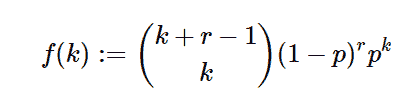

# 不错。stats . negativebinomial()用 Python

表示

> 原文:[https://www . geeksforgeeks . org/sympy-stats-negatebinomial-in-python/](https://www.geeksforgeeks.org/sympy-stats-negativebinomial-in-python/)

借助`**sympy.stats.NegativeBinomial()**`方法，我们可以得到代表负二项分布的随机变量。


> **语法:** `sympy.stats.NegativeBinomial(name, r, p)`
> **返回:**返回随机变量。

**例#1 :**
在这个例子中我们可以看到，通过使用`sympy.stats.NegativeBinomial()`方法，我们能够通过使用这个方法得到负二项分布。

```py
# Import sympy and Negativebinomial
from sympy.stats import NegativeBinomial, density, E, variance
from sympy import Symbol, S

r = 5
p = S.One / 5

# Using sympy.stats.NegativeBinomial() method
X = NegativeBinomial("x", r, p)
gfg = density(X)(0.5)

print(gfg)
```

**输出:**

> 0.360633043411166

**例 2 :**

```py
# Import sympy and Negativebinomial
from sympy.stats import NegativeBinomial, density, E, variance
from sympy import Symbol, S

r = 4
p = 0.6
z = Symbol("z")

# Using sympy.stats.NegativeBinomial() method
X = NegativeBinomial("x", r, p)
gfg = density(X)(z)

print(gfg)
```

**输出:**

> 0.0256 * 0.6 * * z *二项式(z + 3，z)