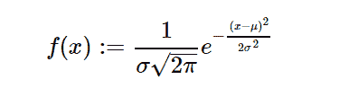

# python 中的 sympy.stats.Normal()

> 原文:[https://www.geeksforgeeks.org/sympy-stats-normal-in-python/](https://www.geeksforgeeks.org/sympy-stats-normal-in-python/)

借助`**sympy.stats.Normal()**`方法，我们可以得到代表正态分布的连续随机变量。



> **语法:** `sympy.stats.Normal(name, mean, std)`
> 其中，mean 和 std 为实数。
> **返回:**返回连续随机变量。

**示例#1 :**
在这个示例中我们可以看到，通过使用`sympy.stats.Normal()`方法，我们能够使用该方法获得表示正态分布的连续随机变量。

```py
# Import sympy and Normal
from sympy.stats import Normal, density
from sympy import Symbol, pprint

z = Symbol("z")
mean = Symbol("mean", positive = True)
std = Symbol("std", positive = True)

# Using sympy.stats.Normal() method
X = Normal("x", mean, std)
gfg = density(X)(z)

pprint(gfg)
```

**输出:**

> 2
> -(-mean+z)
> ———
> 2
> _ _ _ 2 * STD
> \/2 * e
> ————
> _ _ _ _
> 2 * \/pi * STD

**例 2 :**

```py
# Import sympy and Normal
from sympy.stats import Normal, density
from sympy import Symbol, pprint

z = 2
mean = 1.8
std = 4

# Using sympy.stats.Normal() method
X = Normal("x", mean, std)
gfg = density(X)(z)

pprint(gfg)
```

**输出:**

> 0.124843847615573 * \/2
> ———————
> _ _ _ _
> \/pi