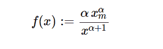

# python 中的 sympy.stats.Pareto()

> 原文:[https://www.geeksforgeeks.org/sympy-stats-pareto-in-python/](https://www.geeksforgeeks.org/sympy-stats-pareto-in-python/)

借助`**sympy.stats.Pareto()**`方法，我们可以得到代表帕累托分布的连续随机变量。


> **语法:** `sympy.stats.Pareto(name, xm, alpha)`
> 其中，xm 和 alpha 是实数，xm、alpha > 0。
> **返回:**返回连续随机变量。

**示例#1 :**
在这个示例中我们可以看到，通过使用`sympy.stats.Pareto()`方法，我们能够使用该方法获得表示帕累托分布的连续随机变量。

```py
# Import sympy and Pareto
from sympy.stats import Pareto, density
from sympy import Symbol, pprint

z = Symbol("z")
xm = Symbol("xm", positive = True)
alpha = Symbol("alpha", positive = True)

# Using sympy.stats.Pareto() method
X = Pareto("x", xm, alpha)
gfg = density(X)(z)

pprint(gfg)
```

**输出:**

> alpha-alpha–1
> alpha * XM * z

**例 2 :**

```py
# Import sympy and Pareto
from sympy.stats import Pareto, density
from sympy import Symbol, pprint

z = 2.1
xm = 1
alpha = 2.4

# Using sympy.stats.Pareto() method
X = Pareto("x", xm, alpha)
gfg = density(X)(z)

pprint(gfg)
```

**输出:**

> 0.192604149590925