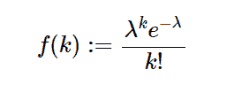

# 不错。stats.Poisson()用 Python

> 原文:[https://www . geesforgeks . org/sympy-stats-poisson-in-python/](https://www.geeksforgeeks.org/sympy-stats-poisson-in-python/)

借助`**sympy.stats.Poisson()**`方法，我们可以得到代表泊松分布的随机变量。



> **语法:** `sympy.stats.Poisson(name, lamda)`
> **返回:**返回随机变量。

**示例#1 :**
在这个示例中我们可以看到，通过使用`sympy.stats.Poisson()`方法，我们能够使用该方法获得表示泊松分布的随机变量。

```
# Import sympy and poisson
from sympy.stats import Poisson, density, E, variance
from sympy import Symbol, simplify

# Using sympy.stats.Poisson() method
rate = Symbol("lambda", positive = True)
X = Poisson("x", rate)
gfg = density(X)(4)

print(gfg)
```

**输出:**

> λ* * 4 * exp(-λ)/24

**例 2 :**

```
# Import sympy and poisson
from sympy.stats import Poisson, density, E, variance
from sympy import Symbol, simplify

# Using sympy.stats.Poisson() method
rate = Symbol("lambda", positive = True)
X = Poisson("x", rate)
gfg = density(X)(6)

print(gfg)
```

**输出:**

> λ* * 6 * exp(-λ)/720