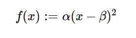

# python 中的 sympy . stats . Quadraticu()

> 原文:[https://www . geesforgeks . org/sympy-stats-quadraticu-in-python/](https://www.geeksforgeeks.org/sympy-stats-quadraticu-in-python/)

借助`**sympy.stats.QuadraticU()**`方法，我们可以得到代表 U-二次分布的连续随机变量。



> **语法:** `sympy.stats.QuadraticU(name, a, b)`
> 其中，a 和 b 为实数，a、b >为 0。
> **返回:**返回连续随机变量。

**示例#1 :**
在这个示例中我们可以看到，通过使用`sympy.stats.QuadraticU()`方法，我们能够通过使用该方法来获得表示 U-二次分布的连续随机变量。

```
# Import sympy and QuadraticU
from sympy.stats import QuadraticU, density
from sympy import Symbol, pprint

z = Symbol("z")
a = Symbol("a", positive = True)
b = Symbol("b", positive = True)

# Using sympy.stats.QuadraticU() method
X = QuadraticU("x", a, b)
gfg = density(X)(z)

pprint(gfg)
```

**输出:**

> /2
> |/a b \
> | 12 * |-––+z |
> | \ 2 2/
> = z，a<= z)
> | 3
> |(-a+b)
> |
> \ 0 否则

**例 2 :**

```
# Import sympy and QuadraticU
from sympy.stats import QuadraticU, density
from sympy import Symbol, pprint

z = 1.5
a = 4
b = 6

# Using sympy.stats.QuadraticU() method
X = QuadraticU("x", a, b)
gfg = density(X)(z)

pprint(gfg)
```

**输出:**

> Zero