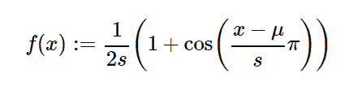

# Python 中的 sympy.stats.RaisedCosine()

> 原文:[https://www . geesforgeks . org/sympy-stats-raised 余弦 in-python/](https://www.geeksforgeeks.org/sympy-stats-raisedcosine-in-python/)

借助`**sympy.stats.RaisedCosine()**`方法，我们可以得到代表升余弦分布的连续随机变量。



> **句法:** `sympy.stats.RaisedCosine(name, mu, s)`
> 其中，μ和 s 为实数，μ、s >为 0。
> 
> **返回:**返回连续随机变量。

**示例#1 :**
在这个示例中我们可以看到，通过使用`sympy.stats.RaisedCosine()`方法，我们能够使用该方法获得表示升余弦分布的连续随机变量。

```
# Import sympy and RaisedCosine
from sympy.stats import RaisedCosine, density
from sympy import Symbol, pprint

z = Symbol("z")
mu = Symbol("mu", positive = True)
s = Symbol("s", positive = True)

# Using sympy.stats.RaisedCosine() method
X = RaisedCosine("x", mu, s)
gfg = density(X)(z)

pprint(gfg)
```

**输出:**

> //pi *(mu+z)\
> | cos |—|+1
> | \ s/
> = mu–s，z < = mu + s)
> | 2*s
> |
> \ 0 否则

**例 2 :**

```
# Import sympy and RaisedCosine
from sympy.stats import RaisedCosine, density
from sympy import Symbol, pprint

z = 1.2
mu = 1
s = 3

# Using sympy.stats.RaisedCosine() method
X = RaisedCosine("x", mu, s)
gfg = density(X)(z)

pprint(gfg)
```

**输出:**

> cos(0.066666666666666 * pi)1
> ————————+–
> 6 6