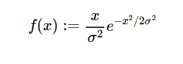

# Python 中的 sympy.stats.Rayleigh()

> 原文:[https://www . geesforgeks . org/sympy-stats-rayley-in-python/](https://www.geeksforgeeks.org/sympy-stats-rayleigh-in-python/)

借助`**sympy.stats.Rayleigh()**`方法，我们可以得到代表瑞利分布的连续随机变量。



> **语法:** `sympy.stats.Rayleigh(name, sigma)`
> 其中，σ为实数，σ为> 0。
> 
> **返回:**返回连续随机变量。

**示例#1 :**
在这个示例中我们可以看到，通过使用`sympy.stats.Rayleigh()`方法，我们能够使用该方法获得表示瑞利分布的连续随机变量。

```py
# Import sympy and Rayleigh
from sympy.stats import Rayleigh, density
from sympy import Symbol, pprint

z = Symbol("z")
sigma = Symbol("sigma", positive = True)

# Using sympy.stats.Rayleigh() method
X = Rayleigh("x", sigma)
gfg = density(X)(z)

pprint(gfg)
```

**输出:**

> 2
> -z
> ——
> 
> 【2】【sigma】
> 【z * e
> ——
> 
> 【sigma】

**例 2 :**

```py
# Import sympy and Rayleigh
from sympy.stats import Rayleigh, density
from sympy import Symbol, pprint

z = 0.35
sigma = 2

# Using sympy.stats.Rayleigh() method
X = Rayleigh("x", sigma)
gfg = density(X)(z)

pprint(gfg)
```

**输出:**

> 0.0861703622690834