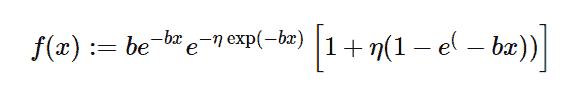

# Python 中的 sympy . stats . shift dgompertz()

> 原文:[https://www . geesforgeks . org/sympy-stats-shift dgompertz-in-python/](https://www.geeksforgeeks.org/sympy-stats-shiftedgompertz-in-python/)

借助`**sympy.stats.ShiftedGompertz()**`方法，我们可以得到代表移位 gompertz 分布的连续随机变量。



> **语法:** `sympy.stats.ShiftedGompertz(name, b, eta)`
> 其中，b 和 eta 为实数，b、eta >为 0。
> 
> **返回:**返回连续随机变量。

**示例#1 :**
在这个示例中我们可以看到，通过使用`sympy.stats.ShiftedGompertz()`方法，我们能够使用该方法获得表示移位 gompertz 分布的连续随机变量。

```
# Import sympy and ShiftedGompertz
from sympy.stats import ShiftedGompertz, density
from sympy import Symbol, pprint

z = Symbol("z")
b = Symbol("b", positive = True)
eta = Symbol("eta", positive = True)

# Using sympy.stats.ShiftedGompertz() method
X = ShiftedGompertz("x", b, eta)
gfg = density(X)(z)

pprint(gfg)
```

**输出:**

> -b * z
> /-b * z \ \-b * z-eta * e
> b * \ eta * \ 1–e/+1/* e * e

**例 2 :**

```
# Import sympy and ShiftedGompertz
from sympy.stats import ShiftedGompertz, density
from sympy import Symbol, pprint

z = 1.1
b = 2
eta = 3

# Using sympy.stats.ShiftedGompertz() method
X = ShiftedGompertz("x", b, eta)
gfg = density(X)(z)

pprint(gfg)
```

**输出:**

> 0.582907142397210