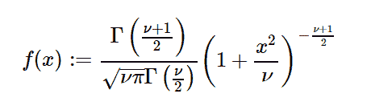

# 很好。stats . studentt()用 Python

表示

> 原文:[https://www . geesforgeks . org/sympy-stats-studentt-in-python/](https://www.geeksforgeeks.org/sympy-stats-studentt-in-python/)

借助`**sympy.stats.StudentT()**`方法，我们可以得到代表学生 t 分布的连续随机变量。



> **句法:** `sympy.stats.StudentT(name, nu)`
> 其中，nu 为实数，nu >为 0。
> **返回:**返回连续随机变量。

**例#1 :**
在这个例子中我们可以看到，通过使用`sympy.stats.StudentT()`方法，我们能够通过使用这个方法得到代表 Student 的 T 分布的连续随机变量。

```py
# Import sympy and StudentT
from sympy.stats import StudentT, density
from sympy import Symbol, pprint

z = Symbol("z")
nu = Symbol("nu", positive = True)

# Using sympy.stats.StudentT() method
X = StudentT("x", nu)
gfg = density(X)(z)

pprint(gfg)
```

**输出:**

> nu 1
> ––––
> 2 2
> /2 \
> | z |
> | 1+–|
> \ nu/
> –––
> _ _ _ _/nu \
> \/nu * B | 1/2，–|
> \ 2/

**例 2 :**

```py
# Import sympy and StudentT
from sympy.stats import StudentT, density
from sympy import Symbol, pprint

z = 0.46
nu = 2

# Using sympy.stats.StudentT() method
X = StudentT("x", nu)
gfg = density(X)(z)

pprint(gfg)
```

**输出:**

> _ _ _ _ _ _
> 0.214993401181957 * \/2