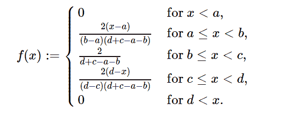

# Python 中的 sympy.stats .梯形()

> 原文:[https://www . geesforgeks . org/sympy-stats-梯形 in-python/](https://www.geeksforgeeks.org/sympy-stats-trapezoidal-in-python/)

借助`**sympy.stats.Trapezoidal()**`方法，利用该方法可以得到代表梯形分布的连续随机变量。



> **句法:** `sympy.stats.Trapezoidal(name, a, b, c, d)`
> 其中，a、b、c、d 为实数。
> **返回:**返回连续随机变量。

**示例#1 :**
在这个示例中我们可以看到，通过使用`sympy.stats.Trapezoidal()`方法，我们能够使用该方法获得表示梯形分布的连续随机变量。

```
# Import sympy and Trapezoidal
from sympy.stats import Trapezoidal, density
from sympy import Symbol, pprint

z = Symbol("z")
a = Symbol("a", positive = True)
b = Symbol("b", positive = True)
c = Symbol("c", positive = True)
d = Symbol("d", positive = True)

# Using sympy.stats.Trapezoidal() method
X = Trapezoidal("x", a, b, c, d)
gfg = density(X)(z)

pprint(gfg)
```

**输出:**

> /-2 * a+2 * z
> |—————————代表 And(a z)
> |(-a+b)*(-a–b+c+d)
> |
> | 2
> |——代表 And(b z)
> = z，c<= z)
> |(-c+d)*(-a–b+c+d)
> |
> \ 0 否则

**例 2 :**

```
# Import sympy and Trapezoidal
from sympy.stats import Trapezoidal, density
from sympy import Symbol, pprint

z = 0.43
a = 2
b = 4
c = 5
d = 8

# Using sympy.stats.Trapezoidal() method
X = Trapezoidal("x", a, b, c, d)
gfg = density(X)(z)

pprint(gfg)
```

**输出:**

> Zero