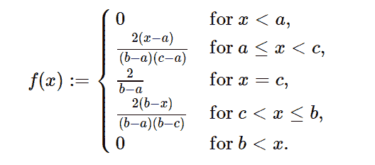

# Python 中的 sympy . stats . trial()

> 原文:[https://www . geesforgeks . org/sympy-stats-trial-in-python/](https://www.geeksforgeeks.org/sympy-stats-triangular-in-python/)

借助`**sympy.stats.Triangular()**`方法，我们可以得到代表三角分布的连续随机变量。



> **句法:** `sympy.stats.Triangular(name, a, b, c)`
> 其中，a、b、c 为实数。
> 
> **返回:**返回连续随机变量。

**示例#1 :**
在这个示例中我们可以看到，通过使用`sympy.stats.Triangular()`方法，我们能够使用该方法获得表示三角分布的连续随机变量。

```py
# Import sympy and Triangular
from sympy.stats import Triangular, density
from sympy import Symbol, pprint

z = Symbol("z")
a = Symbol("a", positive = True)
b = Symbol("b", positive = True)
c = Symbol("c", positive = True)

# Using sympy.stats.Triangular() method
X = Triangular("x", a, b, c)
gfg = density(X)(z)

pprint(gfg)
```

**输出:**

> /-2 * a+2 * z
> |——————用于 And(a z)
> |(-a+b)*(-a+c)
> |
> | 2
> |——用于 c = z
> = z，c<z)
> |(-a+b)*(b–c)
> |
> \ 0 否则

**例 2 :**

```py
# Import sympy and Triangular
from sympy.stats import Triangular, density
from sympy import Symbol, pprint

z = 5
a = 1.2
b = 1.3
c = 1.27

# Using sympy.stats.Triangular() method
X = Triangular("x", a, b, c)
gfg = density(X)(z)

pprint(gfg)
```

**输出:**

> Zero