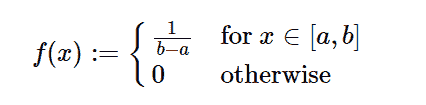

# Python 中的 sympy.stats.Uniform()

> 原文:[https://www . geesforgeks . org/sympy-stats-uniform-in-python/](https://www.geeksforgeeks.org/sympy-stats-uniform-in-python/)

借助`**sympy.stats.Uniform()**`方法，我们可以得到代表均匀分布的连续随机变量。



> **语法:** `sympy.stats.Uniform(name, left, right)`
> 其中，左右为实数，-oo <左，左<右< +oo
> 
> **返回:**返回连续随机变量。

**示例#1 :**
在这个示例中我们可以看到，通过使用`sympy.stats.Uniform()`方法，我们能够使用该方法获得表示均匀分布的连续随机变量。

```py
# Import sympy and Uniform
from sympy.stats import Uniform, density
from sympy import Symbol, pprint

z = Symbol("z")
a = Symbol("a", positive = True)
b = Symbol("b", positive = True)

# Using sympy.stats.Uniform() method
X = Uniform("x", a, b)
gfg = density(X)(z)

pprint(gfg)
```

**输出:**

> / 1
> |——对于(b > = z，a<= z)
> <-a+b
> |
> \ 0 否则

**例 2 :**

```py
# Import sympy and Uniform
from sympy.stats import Uniform, density
from sympy import Symbol, pprint

z = 0.3
a = -3
b = 4

# Using sympy.stats.Uniform() method
X = Uniform("x", a, b)
gfg = density(X)(z)

pprint(gfg)
```

**输出:**

> 1/7