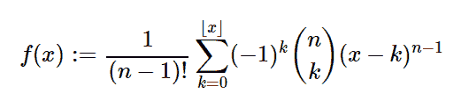

# Python 中的 sympy.stats.UniformSum()

> 原文:[https://www . geesforgeks . org/sympy-stats-uniformsum-in-python/](https://www.geeksforgeeks.org/sympy-stats-uniformsum-in-python/)

借助`**sympy.stats.UniformSum()**`方法，我们可以得到代表欧文-霍尔分布的连续随机变量。



> **语法:** `sympy.stats.UniformSum(name, n)`
> 其中，n 为实数。
> 
> **返回:**返回连续随机变量。

**例#1 :**
在这个例子中我们可以看到，通过使用`sympy.stats.UniformSum()`方法，我们能够通过使用这个方法得到代表 irwin-hall 分布的连续随机变量。

```
# Import sympy and UniformSum
from sympy.stats import UniformSum, density
from sympy import Symbol, pprint

z = Symbol("z")
n = Symbol("n", positive = True)

# Using sympy.stats.UniformSum() method
X = UniformSum("x", n)
gfg = density(X)(z)

pprint(gfg)
```

**输出:**

> 地板(z)
> _ _ _
> \ `
> \ k n–1/n \
> )(-1)*(-k+z)* | |
> /\ k/
> /_ _，
> k = 0
> —————
> (n–1)！

**例 2 :**

```
# Import sympy and UniformSum
from sympy.stats import UniformSum, density
from sympy import Symbol, pprint

z = 3
n = 5

# Using sympy.stats.UniformSum() method
X = UniformSum("x", n)
gfg = density(X)(z)

pprint(gfg)
```

**输出:**

> 3
> 
> \ `
> \ k 4/5 \
> )(-1)*(3–k)* |
> /\ k/
> /_ _，
> k = 0
> ——————————
> 24